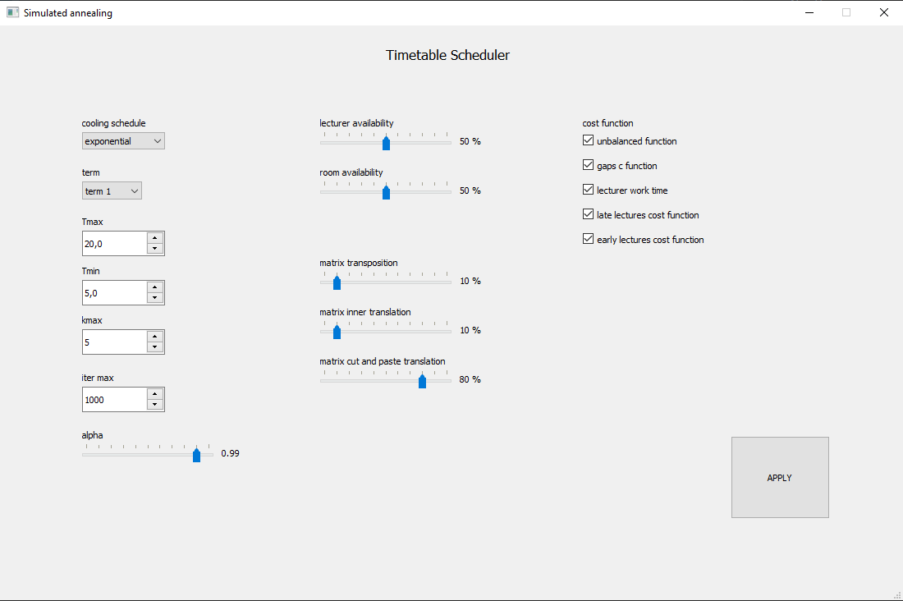
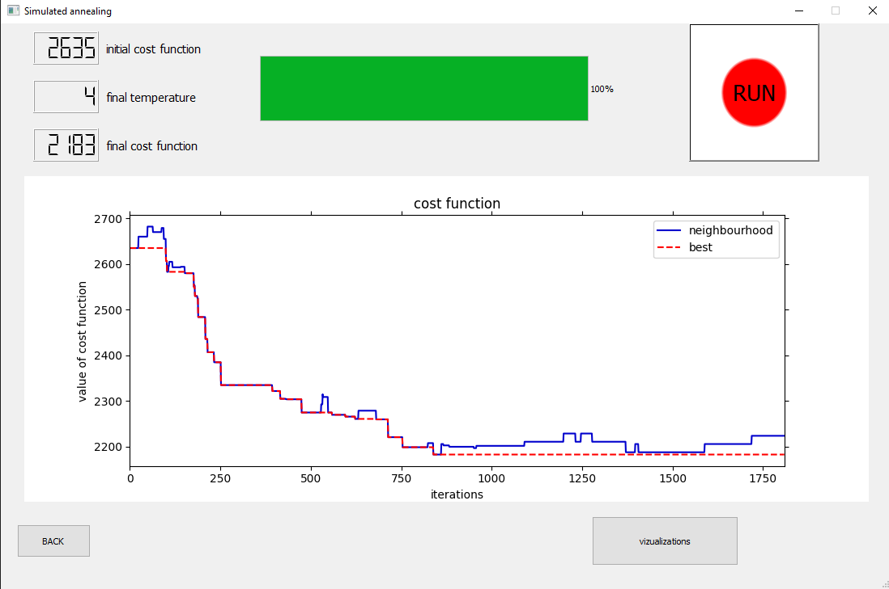
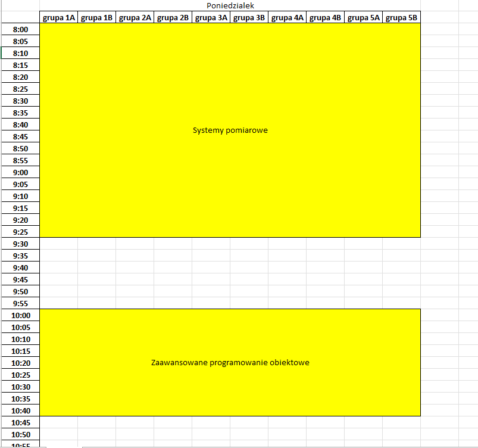

# timetable-scheduler

## Description

Timetable scheduler is a program for creating timetables
based on the previously delivered syllabus. It tries to optimize it according to restrictions and
cost functions imposed by the user using a custom simulated annealing algorithm. The main advantage of
our solution is the fact that we take into account travel times between buildings and what's more the
Process Image mechanism we are using allows scaling from optimizing a timetable for one particular term
up to generating timetables for the whole faculty or even further if you're brave enough.

## Requirements
* Python 3.8 or newer, but it might work on older versions too.
* PyQt 5
* matplotlib
* pandas
* NumPy
* openpyxl
* a spreadsheet compatible with .xlsx files

## Features
* Creates timetables for a given term.
* Works with multiple cost functions.
* Simulated annealing optimizer with lots of adjustable parameters and cooling schedules.
* Returns output in a spreadsheet-readable way.

## Screenshots
#### Settings menu:

#### Real-time function cost change graph:

#### Part of [a sample output](results/best_solution.xlsx) in Microsoft Excel:

## Setup
After setting up a new Python 3.8+ environment you can install all dependencies with:

`pip install -r requirements.txt`

Launch the app by typing:

`python app.py`

or running it directly from your IDE.

`main.py` is also available for more in depth experience.

## Possible extensions
* extending the Process Image mechanism with a syllabus pipeline there would be a
possibility to create timetables for multiple terms while not violating any restrictions such as
lecturer or room availability. 
* with an additional layer of abstraction the algorithm would theoretically be able to
create timetables for other types of institutions.